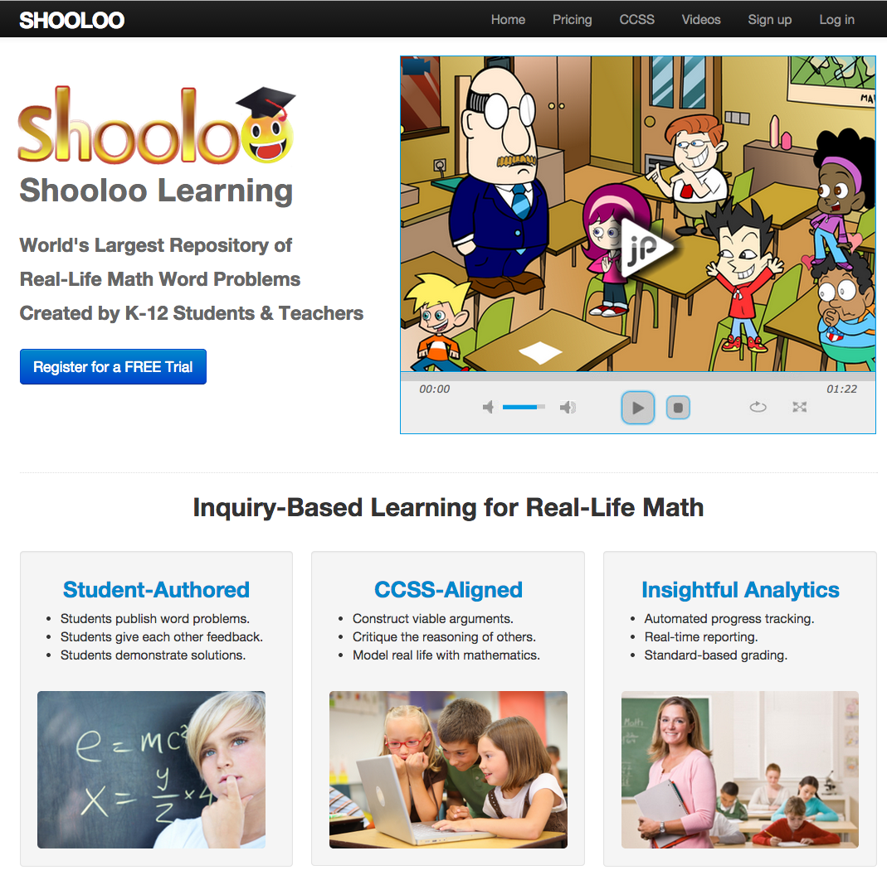
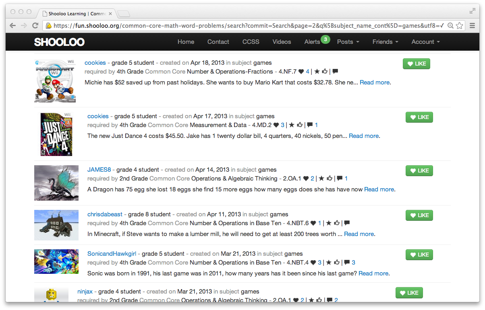
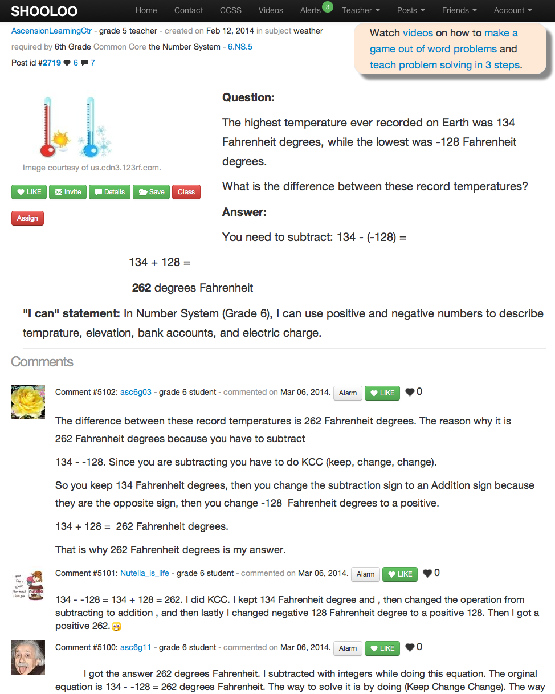
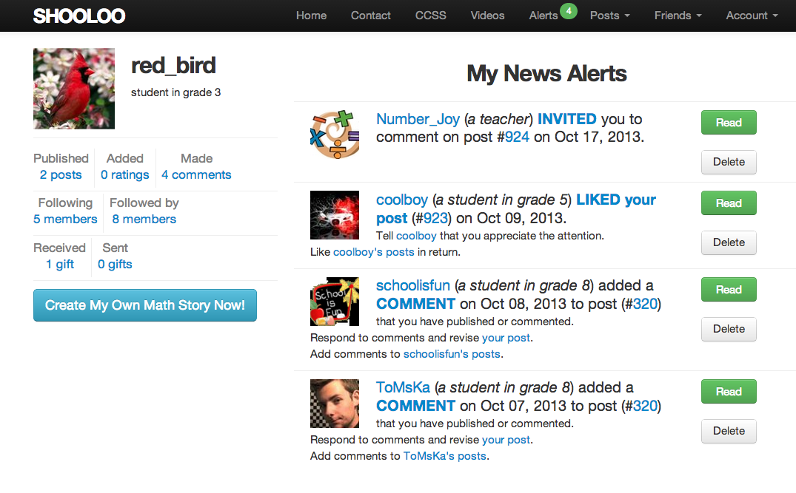
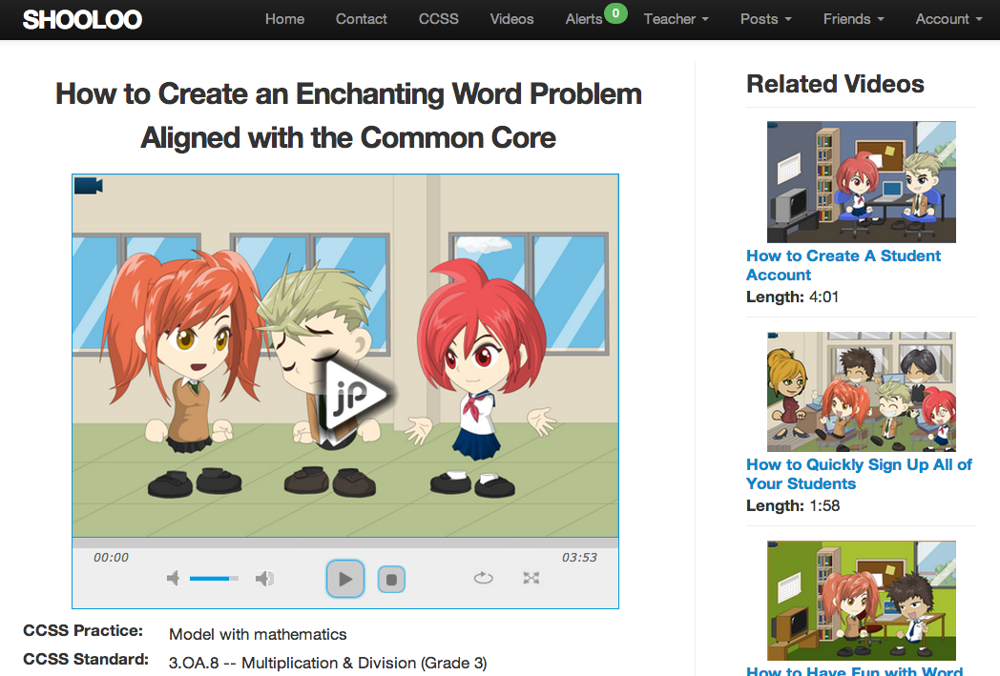
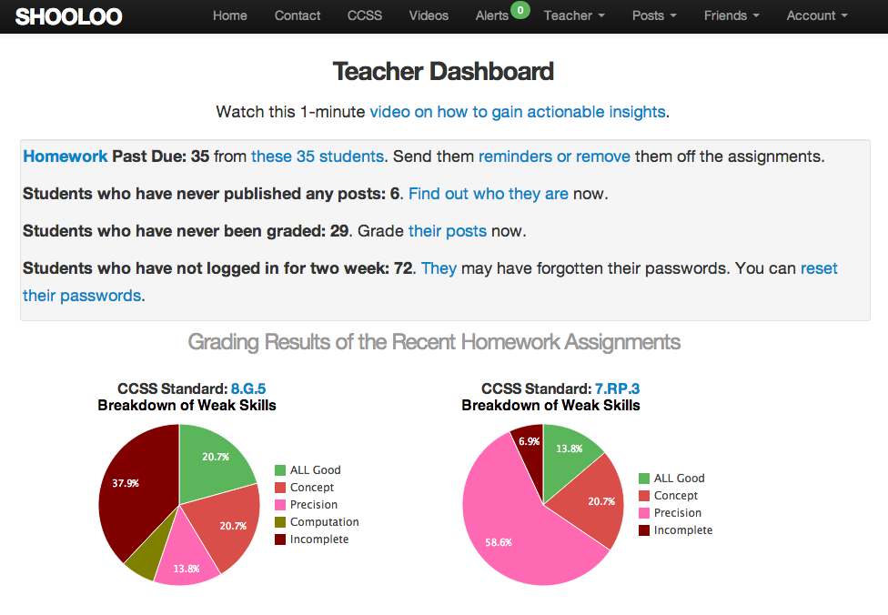
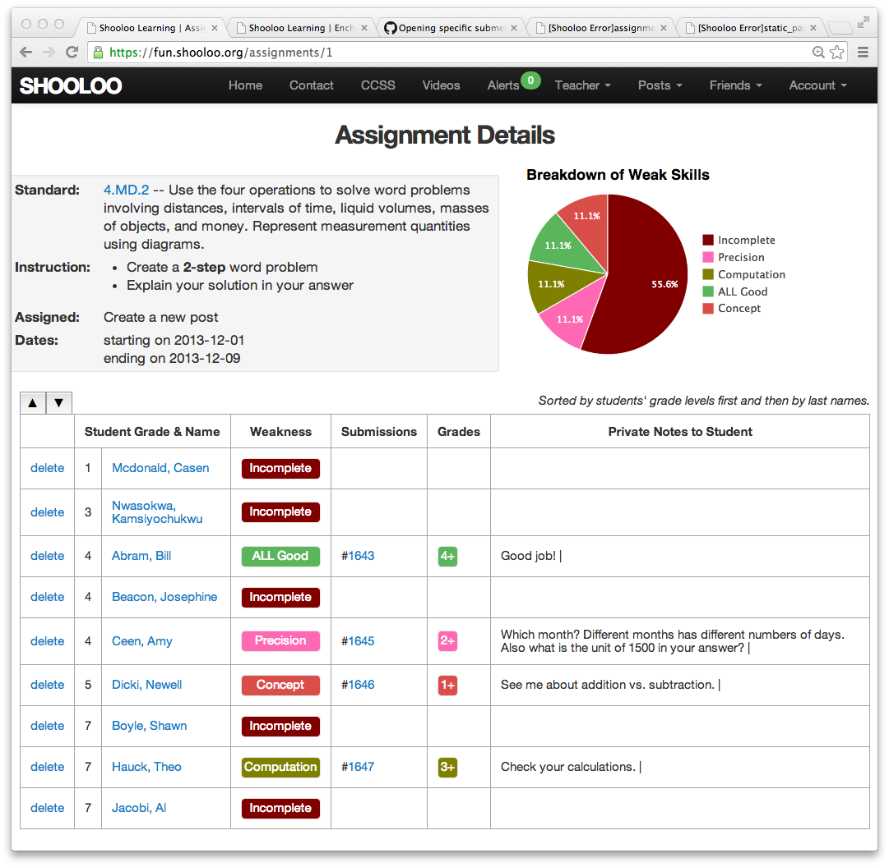

<html>
<head>
  <meta charset="utf-8">
  <link href="/app/assets/stylesheets/application.css" rel="stylesheet">
  <link href="/app/assets/stylesheets/custom.css.scss" rel="stylesheet">
</head>
<body>
  <h1 style="margin-top: -10px;">Shooloo Learning</h1>
  <h4><i>A Crowd-Sourcing Platform for Math Education</i></h4>
  <h5><a href="https://fun.shooloo.org">See live site at shooloo.org</a> </h5>
  
 Shooloo Learning is a live production app built on Ruby on Rails, html, CSS, and JavaScript. Currently Shooloo has close to 2,000 users and 5,000 real-life math problems aligend with the Common State Standards.

  <h2>Screen Shots</h2>
  
  
  
  
  
  
  
</body>
</html>